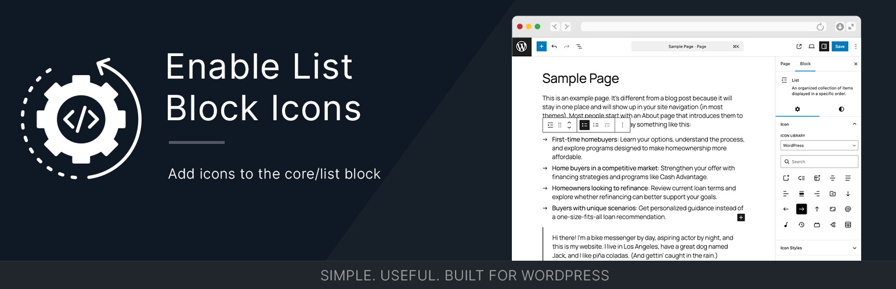

# Enable List Icons



[](https://wordpress.org/)
[](https://www.php.net/)
[](https://github.com/bob-moore/enable-list-icons/releases/latest)
[](https://www.gnu.org/licenses/gpl-2.0.html)

[](https://github.com/bob-moore/enable-list-icons/actions/workflows/lint-css.yml)
[](https://github.com/bob-moore/enable-list-icons/actions/workflows/lint-js.yml)
[](https://github.com/bob-moore/enable-list-icons/actions/workflows/lint-php.yml)

Want to give it a test drive? Try it in the WP Playground: [](https://playground.wordpress.net/?blueprint-url=https://raw.githubusercontent.com/bob-moore/enable-list-icons/main/_playground/blueprint-github.json)

Add icons to the WordPress List block (`core/list`) in both the editor and frontend.

## Features

- Adds icon controls to `core/list` in the block inspector.
- Supports icon libraries:
    - WordPress icons
    - MUI icons
    - MUI variant families, including Outlined, Rounded, and Sharp
    - Custom SVG input
- Lets you set icon placement inside the list item or outside as an aligned marker.
- Lets you set icon color, size, gap, and vertical offset per list block.
- Renders sanitized inline SVG for each list item on the frontend.
- Ships with GitHub-based plugin updates in the WordPress admin update UI.

## Requirements

- WordPress 6.9+
- PHP 8.2+

## Installation

### Install as a plugin

1. Download the latest release zip from GitHub releases.
2. In WordPress admin, go to Plugins -> Add New Plugin -> Upload Plugin.
3. Upload the zip and activate Enable List Icons.

### Install via Composer (library usage)

If you are embedding this into your own project:

```bash
composer require bmd/enable-list-icons
```

Then bootstrap:

```php
use Bmd\EnableListIcons\Plugin;

$dependency_url  = plugin_dir_url( __FILE__ ) . 'vendor/bmd/enable-list-icons/';
$dependency_path = plugin_dir_path( __FILE__ ) . 'vendor/bmd/enable-list-icons/';

$plugin = new Plugin(
    $dependency_url,
    $dependency_path
);

$plugin->mount();
```

The `Plugin` constructor expects the URL and filesystem path to the Enable List Icons dependency root, not the file where you call it. For example, pass `/path/to/vendor/bmd/enable-list-icons/` and the matching public URL for that directory.

## Usage

1. Add a List block.
2. Open the block sidebar.
3. Open the Icon panel.
4. Choose an icon source (WordPress, MUI, or Custom SVG).
5. Adjust icon placement, color, size, gap, and vertical offset.
6. Save and view the post.

## Custom Icon Families

Developers can add static JSON icon families with the `enable_list_icons_icon_families` filter. Each JSON file should contain an array of picker-compatible icon objects with `name`, `label`, and `source` properties.

```php
add_filter( 'enable_list_icons_icon_families', function ( $families ) {
    $families['brand-icons'] = array(
        'label' => 'Brand Icons',
        'url'   => plugin_dir_url( __FILE__ ) . 'icons/brand-icons.json',
    );

    return $families;
} );
```

## Icon Placement

### Inside

The icon appears inline before each list item text. This is useful when the icon should feel like part of the content flow.

### Outside

The icon appears in reserved space beside each list item. This is useful for aligned visual markers and larger icons.

## Updates

This plugin is distributed through GitHub releases (not WordPress.org). The plugin includes a scoped GitHub updater so WordPress can detect and apply new versions from this repository.

## Changelog

### 0.3.0

- Refined the PHP plugin architecture around a dedicated bootstrapper, plugin service, and utility helper.
- Updated Composer autoloading for the new `Bmd\EnableListIcons` namespace structure.
- Added JSON icon family loading with support for WordPress, MUI, MUI Outlined, MUI Rounded, and MUI Sharp families.
- Added separate GitHub Actions lint workflows for CSS, JS, and PHP.
- Added a WordPress Playground blueprint and demo list content.
- Updated release packaging to include built assets and production Composer files.

### 0.2.0

- Added toggle-to-deselect behavior for the icon picker.
- Added a dedicated "Icon Styles" panel grouping placement, size, gap, and vertical offset controls.
- Improved unit/range control layout with a shared label and stacked input plus slider.
- Fixed null handling for icon attributes throughout (`IconValue` properties now nullable).
- Fixed icon outside placement removing excess left padding on list items.

### 0.1.0

- Initial release as Enable List Icons.
- Added icon picker with WordPress and MUI icon sets.
- Added inside/outside placement toggle.
- Added icon color, size, gap, and vertical offset controls.
- Added server-side render filter for `core/list`.
- Added scoped GitHub updater via `wpify/scoper`.
